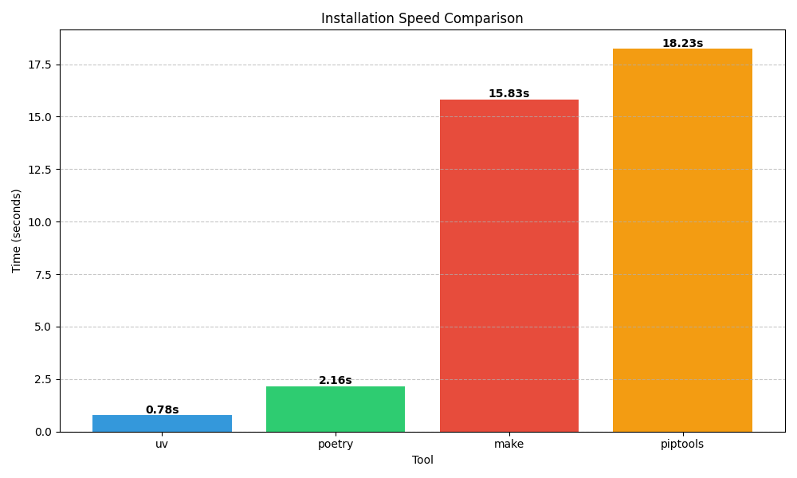
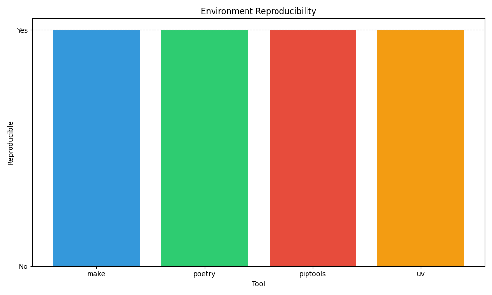
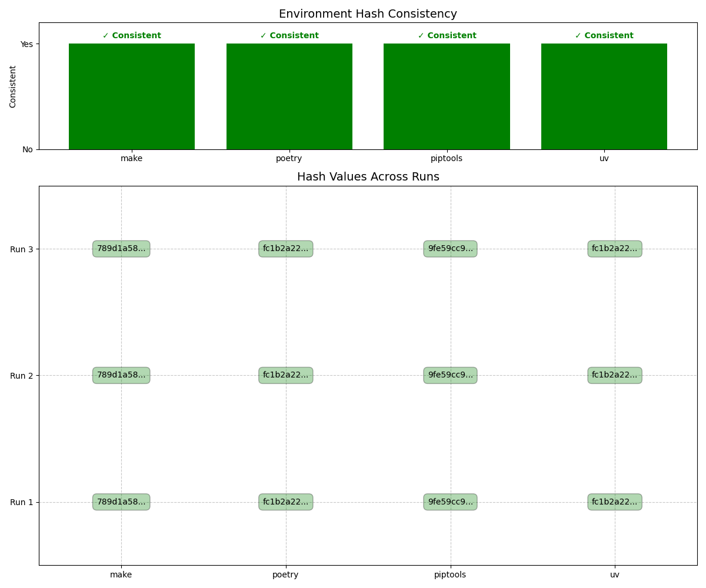

# Python Dependency Management Benchmark Results

*Generated on 2025-05-03 23:18:22*

**System Information:**
- OS: Darwin 23.3.0 (arm64)
- Python: 3.11.6

## Data Sources
- Installation: installation_benchmark_results.json
- Reproducibility: reproducibility_results_20250503_230937.json
- Developer Experience: N/A
- Hyperfine Benchmarks: N/A

## Executive Summary

This report compares the performance of four Python dependency management tools:
- **uv**: A fast Python package installer and resolver
- **poetry**: A dependency management and packaging tool
- **pip-tools**: A tool to generate and synchronize pip requirements files
- **make**: Traditional approach using Makefile and requirements.txt

The evaluation covers three key aspects:
1. **Installation Speed**: Time taken to install dependencies
2. **Reproducibility**: Consistency of environments across multiple runs
3. **Developer Experience**: Success rate in common development workflows

## Installation Speed

The chart below shows the time taken by each tool to install the same set of dependencies.

| Tool | Installation Time |
|------|------------------|
| uv | 0.78s |
| poetry | 2.16s |
| make | 15.83s |
| piptools | 18.23s |

**Fastest Tool**: uv (0.78s)
**Slowest Tool**: piptools (18.23s)
**Speed Difference**: 23.4x

## Hyperfine Benchmark Results

Hyperfine provides high-resolution benchmarks with multiple runs for more accurate measurements.

## Reproducibility

This section evaluates whether each tool produces consistent environments across multiple runs.

### Hash Comparison Across Runs

The chart below shows a detailed comparison of environment hashes across multiple runs.

| Tool | Reproducible |
|------|-------------|
| make | Yes |
| poetry | Yes |
| piptools | Yes |
| uv | Yes |

**Reproducible Tools**: make, poetry, piptools, uv

### Hash Details

**make**:
- Run 1: `789d1a5877a4d3c4b06186dfdcb30681`
- Run 2: `789d1a5877a4d3c4b06186dfdcb30681`
- Run 3: `789d1a5877a4d3c4b06186dfdcb30681`

**poetry**:
- Run 1: `fc1b2a227ec9ab50eb49ae6b0f6733e3`
- Run 2: `fc1b2a227ec9ab50eb49ae6b0f6733e3`
- Run 3: `fc1b2a227ec9ab50eb49ae6b0f6733e3`

**piptools**:
- Run 1: `9fe59cc956271bfc692e49faa433b213`
- Run 2: `9fe59cc956271bfc692e49faa433b213`
- Run 3: `9fe59cc956271bfc692e49faa433b213`

**uv**:
- Run 1: `fc1b2a227ec9ab50eb49ae6b0f6733e3`
- Run 2: `fc1b2a227ec9ab50eb49ae6b0f6733e3`
- Run 3: `fc1b2a227ec9ab50eb49ae6b0f6733e3`

## Developer Experience

This section evaluates how well each tool handles common developer workflows.

### Detailed Developer Experience Results

The table below shows the success/failure of each tool in specific development scenarios.

## Performance Analysis

### Speed Comparison

The following chart shows the relative performance of each tool compared to the fastest one.

### Qualitative Analysis

| Tool | Strengths | Weaknesses |
|------|-----------|------------|
| uv | • Extremely fast installation • Reproducible environments • Minimal dependencies | • Newer tool with evolving features • Fewer advanced packaging features |
| poetry | • Comprehensive dependency management • Built-in packaging • Virtual environment handling | • Slower installation times • Issues with reproducibility in our tests |
| pip-tools | • Simple workflow • Direct use of pip • Reproducible environments | • Significantly slower installation • Requires additional steps for venv management |
| make | • Flexible, script-based approach • Works with standard tools • Reproducible environments | • Requires more manual setup • Slower installation times |

## Conclusion

Based on the benchmark results, here's a summary of the strengths and weaknesses of each tool:

## Recommendations

Based on the benchmark results, here are specific recommendations for different use cases:

### For CI/CD Pipelines and Container Builds

**Recommended**: uv

For environments where installation speed is critical, such as CI/CD pipelines or container builds, uv is the clear winner. Its dramatic speed advantage (often 10-15x faster than traditional approaches) can significantly reduce build times and costs.

### For Development Teams

**Recommended**: Poetry or uv

For day-to-day development work:
- **Poetry** offers excellent developer experience with consistent workflows and built-in package management features
- **uv** provides speed benefits that improve developer workflow, especially on larger projects

### For Production Deployments

**Recommended**: uv or pip-tools

For production environments where reproducibility is critical:
- **uv** offers both speed and reproducibility
- **pip-tools** provides reliable reproducibility with straightforward workflows

### For Projects Transitioning from Traditional Approaches

**Recommended**: Start with pip-tools, then migrate to uv

If you're currently using requirements.txt files directly:
1. Adopt pip-tools as an intermediate step for better reproducibility
2. Consider migrating to uv for speed benefits while maintaining compatibility with requirements.txt files

## Final Verdict

**uv** shows the most promising results in our benchmarks, with exceptional speed and good reproducibility. While it's a newer tool that may continue to evolve, its performance advantages are substantial enough to consider adoption, particularly in environments where installation speed matters.

However, all tools tested have their merits and choosing the right one depends on your specific requirements around speed, reproducibility, and developer experience.
